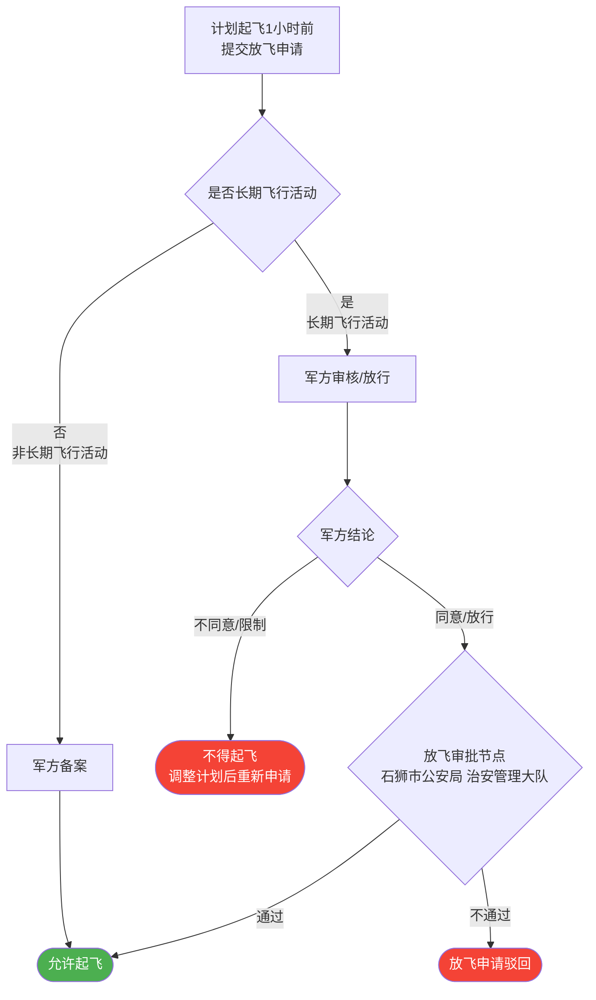

# 点菜系统 (Order System)

一个完整的智能点菜系统，支持微信公众号，包含后台管理和移动端用户界面。

## 项目简介

本项目是一个功能完善的点菜系统，包含：
- 🎨 **后台管理系统**：基于 Vue 3 + Element Plus 的美观管理界面
- 📱 **移动端应用**：基于 Vue 3 + Vant UI 的微信公众号网页
- 🚀 **后端服务**：基于 Node.js + Express 的 RESTful API
- 💾 **数据库**：MySQL 数据存储

## 主要功能

### 后台管理
- ✅ 菜品管理（上传、编辑、删除）
- ✅ 分类管理
- ✅ 订单管理
- ✅ 用户管理
- ✅ 评价管理
- ✅ 数据统计

### 移动端
- ✅ 菜品浏览和搜索
- ✅ 按日期点菜
- ✅ 购物车功能
- ✅ 订单管理
- ✅ 菜品评价
- ✅ 微信登录
- ✅ 微信消息推送

## 技术栈

### 后端
- Node.js 18+
- Express.js 4.x
- MySQL 8.0
- Redis 6.x
- JWT 认证
- 微信公众号 SDK

### 后台前端
- Vue 3 (Composition API)
- Element Plus
- Vue Router 4
- Pinia
- Vite
- Axios

### 移动端前端
- Vue 3 (Composition API)
- Vant UI 4.x
- Vue Router 4
- Pinia
- Vite
- Axios

## 项目结构

```
order-system/
├── backend/              # 后端服务
├── admin-frontend/       # 后台管理前端
├── mobile-frontend/      # 移动端前端
├── database/            # 数据库文件
└── docs/                # 文档
```

## 快速开始

详细的安装和部署指南请查看 [开发文档](./docs/DEPLOYMENT.md)

### 环境要求

- Node.js >= 18.0.0
- MySQL >= 8.0
- Redis >= 6.0

## 文档

- [产品需求文档 (PRD) — 含飞行活动审批流程图](./docs/PRD.md)
- [API 接口文档](./docs/API.md)
- [数据库设计文档](./docs/DATABASE.md)
- [部署文档](./docs/DEPLOYMENT.md)

## 飞行活动审批流程（放飞环节概览）

> 完整流程图见 [docs/PRD.md](./docs/PRD.md)。以下为放飞阶段核心路径：
>
> - **非长期飞行活动**：提交放飞申请 → 军方备案 → 允许起飞（不回流公安审批）
> - **长期飞行活动**：提交放飞申请 → 军方审核/放行（阻断式）→ 军方同意 → 公安放飞审批 → 允许起飞



## 开发进度

- [x] 项目框架搭建
- [ ] 后端 API 开发
- [ ] 后台管理系统开发
- [ ] 移动端开发
- [ ] 微信集成
- [ ] 测试和优化
- [ ] 部署上线

## 许可证

MIT License

## 作者

123-ding

---

⭐ 如果这个项目对您有帮助，请给个 Star！