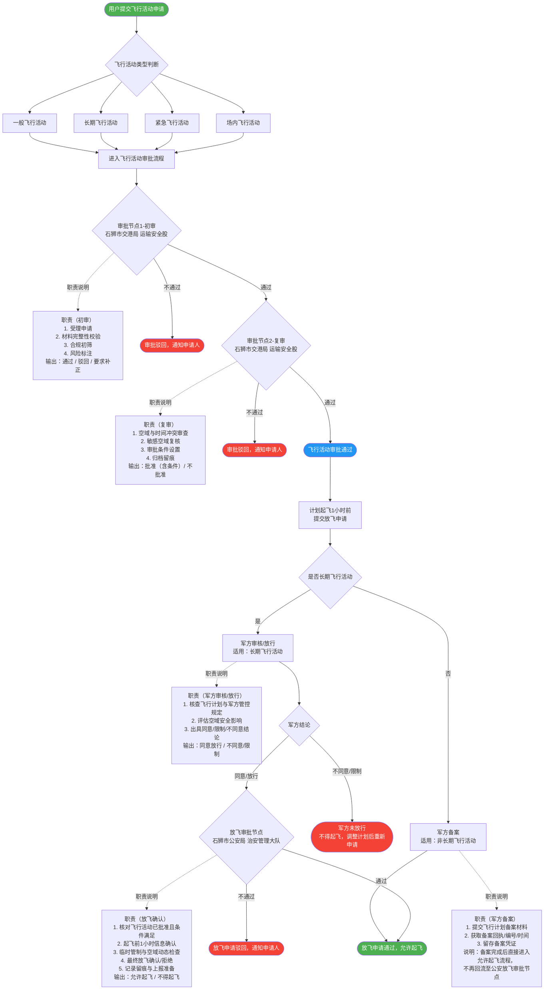
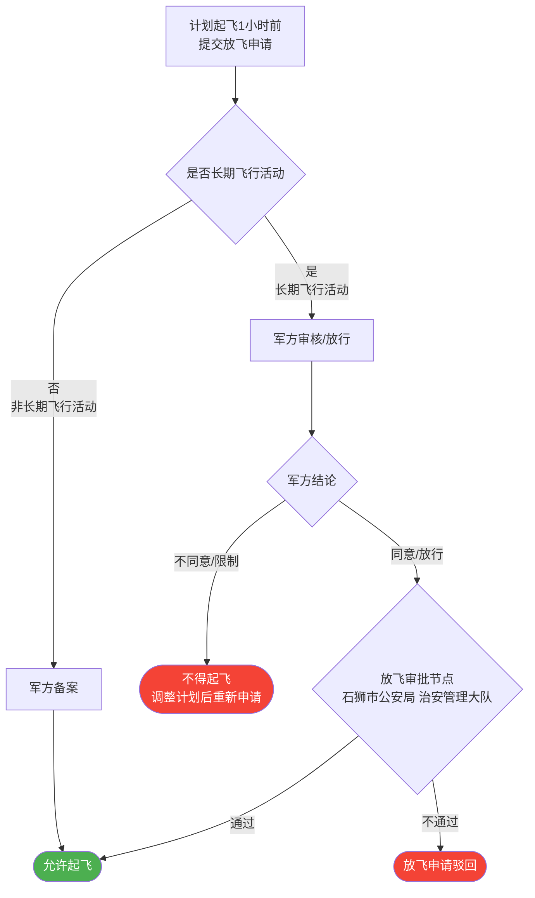

# 无人机飞行活动审批系统 — 产品需求文档（PRD）

## 1. 项目背景

本系统用于支持石狮市无人机飞行活动的全流程在线审批与放飞管理，覆盖飞行活动申请、交港局运输安全股双节点审批、军方备案/审核、公安治安管理大队放飞确认等环节。

---

## 2. 飞行活动类型说明

| 类型 | 说明 | 军方处理方式 |
|------|------|------------|
| 一般飞行活动 | 日常短期飞行任务 | 军方备案（不阻断主流程） |
| 长期飞行活动 | 周期性/持续性飞行任务 | 军方审核/放行（阻断式，须军方同意方可进入放飞流程） |
| 紧急飞行活动 | 应急救援等紧急任务 | 军方备案（不阻断主流程） |
| 场内飞行活动 | 封闭场地内飞行 | 军方备案（不阻断主流程） |

---

## 3. 全流程审批流程图

> **可读性说明**：菱形节点仅保留「节点名称 + 审批部门」，完整职责通过虚线连接至旁路矩形「职责说明」节点，避免菱形内容过长导致渲染截断。

---

## 4. 关键业务规则说明

### 4.1 军方节点插入位置

军方处理节点插入在「K：计划起飞1小时前·提交放飞申请」与「L：放飞审批节点（石狮市公安局 治安管理大队）」**之间**，即在 `K → X{是否长期飞行活动}` 判断后，分两条路径处理：

| 路径 | 触发条件 | 处理方式 | 后续流转 |
|------|----------|----------|----------|
| 军方审核/放行 | 长期飞行活动（自动识别） | 阻断式，须军方出具同意结论 | 同意 → 公安放飞审批（L）；不同意 → 不得起飞 |
| 军方备案 | 非长期飞行活动 | 非阻断，留存备案凭证即可 | 备案完成 → 直接进入**允许起飞**，**不回流公安** |

### 4.2 军方备案不回流公安（关键约束）

- 军方备案路径（非长期飞行活动）备案完成后，**直接结束放飞流程进入起飞阶段**，不再经过公安治安管理大队放飞审批节点（L）。
- 公安治安管理大队放飞审批节点（L）仅适用于**长期飞行活动经军方审核同意后**的场景。

### 4.3 各节点职责完整性

所有审批节点均通过旁路职责说明矩形节点（虚线连接）保留完整职责，不在菱形判断节点内堆砌文字，保证流程图可读性与可展示性。

---

## 5. 审批节点职责汇总

### 5.1 审批节点1（初审）— 石狮市交港局 运输安全股

| 职责 | 说明 |
|------|------|
| 受理申请 | 接收并登记飞行活动申请材料 |
| 材料完整性校验 | 确认申请材料齐全、规范 |
| 合规初筛 | 核查申请是否符合基本法规要求 |
| 风险标注 | 识别并标注潜在风险点 |
| **输出** | 通过 / 驳回 / 要求补正 |

### 5.2 审批节点2（复审）— 石狮市交港局 运输安全股

| 职责 | 说明 |
|------|------|
| 空域与时间冲突审查 | 核查申请空域和时间段是否存在冲突 |
| 敏感空域复核 | 对涉及敏感区域的申请进行专项复核 |
| 审批条件设置 | 为批准的申请附加必要条件与限制 |
| 归档留痕 | 完整记录审批过程与结论 |
| **输出** | 批准（含条件）/ 不批准 |

### 5.3 放飞审批节点 — 石狮市公安局 治安管理大队

> 仅适用于**长期飞行活动**经军方审核同意后的场景。

| 职责 | 说明 |
|------|------|
| 核对已批条件满足 | 确认飞行活动已获审批且各项条件满足 |
| 起飞前1小时信息确认 | 在计划起飞1小时前完成信息核对 |
| 临时管制与空域动态检查 | 检查是否存在临时管制或空域动态变化 |
| 最终放飞确认/拒绝 | 出具放飞确认或拒绝结论 |
| 记录留痕与上报准备 | 完整记录放飞过程并准备上报材料 |
| **输出** | 允许起飞 / 不得起飞 |

---

## 6. 放飞申请流程简图（放飞环节局部）

> 此简图聚焦放飞阶段，展示 K → 军方节点 → 放飞结果 的核心路径。

**说明**：
- 军方备案路径（`X --否--> M1 --> N`）：备案完成后**直接允许起飞**，不经过公安放飞审批（L）。
- 军方审核/放行路径（`X --是--> M --> M2`）：军方同意后进入公安放飞审批（L），军方不同意则不得起飞。

---

## 7. 变更记录

| 版本 | 日期 | 变更说明 |
|------|------|----------|
| v1.0 | 2026-03-24 | 初版，新增军方备案节点（非长期，不回流公安）与军方审核/放行节点（长期飞行活动，阻断式）；采用旁路职责说明节点解决菱形内容过长导致展示截断问题 |
