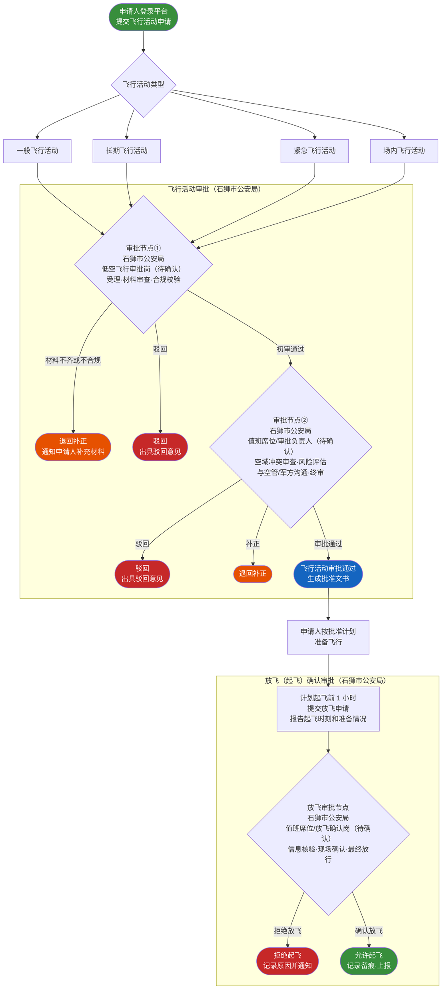
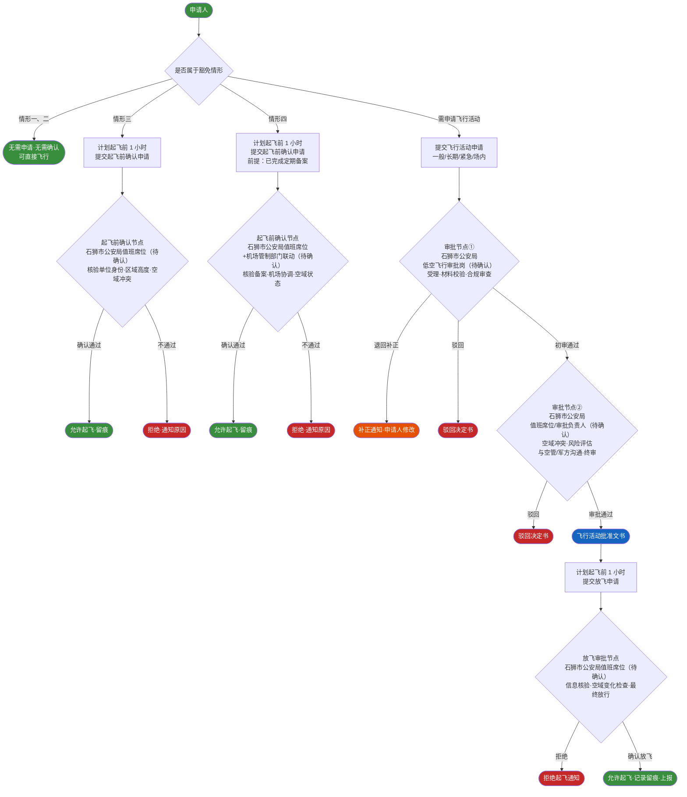

# 石狮低空飞行服务平台——飞行活动及放飞申请审批流程说明

> **文档版本**：v1.1  
> **生效日期**：待业主确认后正式发布  
> **适用范围**：石狮市低空经济服务平台（内网审批端）飞行活动申请与放飞（起飞）申请审批全流程

---

## 一、背景与依据

石狮市政府建设的石狮市低空经济服务平台，面向石狮市公众用户，具备申请低空飞行活动的功能。

**法规依据**：《无人驾驶航空器飞行管理暂行条例》规定，单位和个人组织无人驾驶航空器实施飞行活动，除部分豁免情形（详见第六章）外，均需向空中交通管理机构申请，经批准后方可飞行；同时须在计划起飞 1 小时前向空中交通管理机构报告预计起飞时刻和准备情况，经确认后方可起飞。

**现阶段沟通结论**：经与漳州空军指挥所、石狮市公安局、石狮市交港局协商，本平台内申请的飞行活动由**石狮市公安局**负责审批。待福建省、泉州市平台建设完成后，本平台审批流程将纵向与省市级平台及国家平台 UOM 打通。

---

## 二、飞行活动类型

| 类型 | 说明 |
|------|------|
| **一般飞行活动** | 常规商业/个人无人机飞行任务 |
| **长期飞行活动** | 周期性、固定区域的持续飞行任务（批量申请） |
| **紧急飞行活动** | 应急救援、突发事件处置等紧急任务 |
| **场内飞行活动** | 在划定封闭场地内的飞行活动 |

---

## 三、审批总流程图

---

## 四、飞行活动审批节点详细说明

### 4.1 审批节点①——受理与初审

| 项目 | 内容 |
|------|------|
| **审批部门** | 石狮市公安局 低空飞行审批岗 / 驻场审批员（**待确认**） |
| **可兼任节点②** | 是（系统支持同一人员兼任两个节点） |

**职责描述**：

1. **受理登记**：在系统内接收并登记飞行活动申请，分配受理编号，记录受理时间戳。
2. **材料完整性校验**：核查申请人信息（姓名/单位、联系方式）、航空器信息（注册编号、型号、最大起飞重量）、操控人员信息（资质证件）、飞行计划（时间、地点、高度、航线、用途）等必填项是否齐全。
3. **基础合规性审查**：
   - 核验申请人/航空器是否在系统黑名单；
   - 比对飞行区域是否位于系统内已录入的禁飞区/限飞区；
   - 确认飞行类型与申报用途是否匹配。
4. **补正告知**：材料不完整或存在明显错误时，一次性告知申请人需补充/修正内容，生成补正通知单并退回。
5. **初审结论输出**：对材料齐全且基础合规的申请，流转至节点②；对不符合申请条件的，出具**驳回意见**并告知理由。

**输出物**：

| 结论 | 文书/操作 | 关键字段 |
|------|-----------|----------|
| **流转节点②** | 系统流转记录 | 受理编号、初审通过时间、审批员工号 |
| **退回补正** | 补正通知单 | 补正事项清单、补正截止时间 |
| **驳回** | 驳回决定书 | 驳回原因条款、审批员工号、驳回时间 |

---

### 4.2 审批节点②——复核与终审

| 项目 | 内容 |
|------|------|
| **审批部门** | 石狮市公安局 低空飞行审批值班席位 / 审批负责人（**待确认**） |
| **可兼任节点①** | 是（系统支持同一人员兼任两个节点） |

**职责描述**：

1. **空域与时间冲突审查**：查询该时段、该空域内已批准的其他飞行活动，检测空间/时间重叠冲突；必要时与相关方协调调整飞行窗口。
2. **风险评估**：综合飞行区域人口密度、地面设施、气象条件、航空器性能、操控人员资质等要素进行安全风险研判。
3. **与空管/军方沟通**（如需）：针对涉及管制空域、军事要地周边、重大活动保障期间等特殊情形，向漳州空军指挥所或相关空管部门通报并获取协调意见。
4. **设置审批条件**：通过审批时可附加条件（如限制飞行高度、限制航线偏差范围、要求实时位置回传等），并在批准文书中明确。
5. **最终审批决定**：出具审批通过文书或驳回决定，并在系统内留痕归档。
6. **归档**：将完整申请材料、审批过程记录、沟通纪要（如有）存档备查。

**输出物**：

| 结论 | 文书/操作 | 关键字段 |
|------|-----------|----------|
| **审批通过** | 飞行活动批准文书 | 批准编号、批准有效期、飞行条件/限制、审批负责人工号、批准时间 |
| **退回补正** | 补正通知单 | 补正事项、补正截止时间 |
| **驳回** | 驳回决定书 | 驳回依据（条款/风险点）、审批负责人工号、驳回时间 |

---

## 五、放飞（起飞）确认审批节点说明

### 5.1 审批节点——放飞确认

| 项目 | 内容 |
|------|------|
| **审批部门** | 石狮市公安局 值班席位 / 放飞确认岗（**待确认**） |
| **兼任说明** | 可与飞行活动审批节点①②人员相同，系统支持同一人员兼任 |
| **触发条件** | 飞行活动已获批准，且申请人在计划起飞 **1 小时前** 通过平台提交放飞申请 |

**职责描述**：

1. **飞行活动批准状态核对**：确认本次放飞对应的飞行活动申请处于"已批准"状态，批准有效期覆盖本次起飞时间。
2. **起飞前 1 小时信息确认**：核验申请人报告的预计起飞时刻、起飞地点、机组/操控人员是否与批准文书一致。
3. **准备情况核验**：审查申请人填报的飞行前准备情况（设备自检结果、飞手到位、通信链路正常等）。
4. **临时空域变化检查**：查询是否有新发临时禁飞通知、空域动态调整或重大活动管控要求，与已批准飞行计划进行比对。
5. **气象适飞核验**（如需）：核查当前及计划飞行时段的气象条件是否满足安全飞行要求。
6. **最终起飞确认/拒绝**：综合以上核验结果，在系统内出具"允许起飞"或"拒绝起飞"指令。
7. **记录留痕与上报**：记录放飞确认时间、确认岗位人员工号、确认结论；飞行结束后更新飞行完成状态，留存完整记录备查。

**输出物**：

| 结论 | 文书/操作 | 关键字段 |
|------|-----------|----------|
| **允许起飞** | 系统放飞确认记录 | 放飞确认编号、确认时间、确认岗人员工号、允许起飞时间窗口 |
| **拒绝起飞** | 拒绝起飞通知 | 拒绝原因（空域冲突/气象/准备不足/批准失效等）、确认岗人员工号、拒绝时间 |

---

## 六、豁免飞行活动情形的起飞前确认说明

根据《无人驾驶航空器飞行管理暂行条例》，以下四类情形**无需向空中交通管理机构提出飞行活动申请**：

| 情形 | 是否需要飞行活动审批 | 是否需要起飞前确认 |
|------|---------------------|-------------------|
| （一）微型、轻型、小型无人机在适飞空域内飞行 | **无需** | **无需** |
| （二）常规农用无人驾驶航空器作业飞行活动 | **无需** | **无需** |
| （三）警察/海关/应急管理部门驻地等上方不超过真高120m飞行 | **无需** | **需要**（起飞前 1 小时） |
| （四）民用无人机在民用运输机场管制地带内执行巡检/勘察/校验任务 | **无需**（需定期备案） | **需要**（起飞前 1 小时） |

### 6.1 备注（三）——特定部门驻地飞行的起飞前确认

**适用情形**：警察、海关、应急管理部门辖有的无人驾驶航空器，在其驻地、地面（水面）训练场、靶场等上方不超过真高 120 米的空域内的飞行活动。

| 项目 | 内容 |
|------|------|
| **确认部门** | 石狮市公安局 低空飞行管理值班席位（**待确认**） |
| **多部门说明** | 若为海关或应急管理部门自用航空器，由其所属单位管理人员在平台内完成确认，并同步通报石狮市公安局值班席位（具体权限分配方案**待确认**） |
| **确认职责** | 1. 核验申请单位是否为警察/海关/应急管理部门授权单位；2. 确认飞行区域严格限定在申请单位驻地/训练场/靶场上方；3. 确认高度不超过真高 120 米；4. 核查当前空域无冲突；5. 系统内出具确认记录并留痕 |
| **输出物** | 起飞前确认记录（含确认时间、操作人员工号、确认结论） |

### 6.2 备注（四）——机场管制地带内特定任务飞行的起飞前确认

**适用情形**：民用无人驾驶航空器在民用运输机场管制地带内执行巡检、勘察、校验等飞行任务（需定期报空中交通管理机构备案）。

| 项目 | 内容 |
|------|------|
| **确认部门** | 石狮市公安局 低空飞行管理值班席位（**待确认**） |
| **联动说明** | 机场管制地带内的起飞前确认涉及民航管制，需明确由石狮市公安局转报还是申请人直接向机场塔台/管制席报备，具体联动机制**待确认** |
| **确认职责** | 1. 核验任务类型是否属于巡检/勘察/校验范畴；2. 确认该航空器已在空中交通管理机构完成定期备案；3. 核查机场当前运行状态与空域协调情况；4. 联系机场管制部门确认无冲突；5. 系统内出具确认记录并留痕 |
| **输出物** | 起飞前确认记录（含备案核验结果、机场协调确认意见、确认时间、操作人员工号） |

---

## 七、各节点与豁免情形汇总流程图

---

## 八、待确认事项

以下事项需业主（石狮市政府/平台建设方）与石狮市公安局进行确认，确认结果将更新至本文档：

| 序号 | 待确认事项 | 备注 |
|------|-----------|------|
| 1 | **审批节点①具体岗位**：负责初审的具体处/科/岗位名称及人员编制（如治安支队、行政审批科等） | 建议在平台指挥大厅设驻场审批席位，确认派驻人数及值班班次 |
| 2 | **审批节点②具体岗位**：负责复核终审的处/科/岗位名称及人员编制，是否与节点①为同一部门或上级岗位 | 如需与空管/军方沟通，确认协调联络渠道（直拨电话/系统对接） |
| 3 | **放飞确认岗具体设置**：放飞确认岗是否独立设置，或由节点②值班人员兼任，值班机制如何安排（7×24 小时/工作日） | 平台内飞行活动涉及夜间或节假日时，需确认紧急联络机制 |
| 4 | **备注（三）中海关/应急管理部门自用航空器**：其起飞前确认是由该部门自行在平台内操作，还是统一由石狮市公安局值班席位审核 | 如由多部门操作，需在系统中分配对应账户和权限 |
| 5 | **备注（四）机场管制地带内**：起飞前确认是否需要在平台内同步通知机场管制部门，确认双方联动机制与接口（系统对接/电话通报） | 如需系统对接，需获取机场方接口规范 |
| 6 | **内网部署与驻场审批**：审批功能部署于内网环境，建议石狮市公安局派员驻场（指挥大厅/办公席位）进行审批操作，需确认**具体派驻人员名单**及权限分配方案 | 指挥大厅席位及内网访问环境由平台建设方负责提供 |
| 7 | **与省/市平台及 UOM 打通后的审批权限调整**：纵向打通后，当前由石狮市公安局承担的审批职责是否调整，审批数据上报字段与频次要求 | 待福建省、泉州市平台建设方案明确后进一步确认 |

---

## 九、后续对接规划（参考）

待福建省低空经济服务平台及泉州市平台建设完成后，本平台将与省市平台及国家平台 UOM 纵向打通，实现：

- 飞行活动申请数据与审批结果的逐级上报（石狮 → 泉州 → 福建省 → UOM）；
- 空域信息、禁飞区更新、飞行冲突预警的逐级下发；
- 特殊空域或跨区域飞行活动的多级联合审批；
- 飞行动态遥测数据（位置/高度/速度）的实时上传监管。

具体对接接口规范、数据标准及审批权限边界，待上级平台发布技术文档后更新。

---

*本文档由平台建设方起草，相关"待确认"标注事项需石狮市公安局及业主方书面确认后方为最终版本。*
