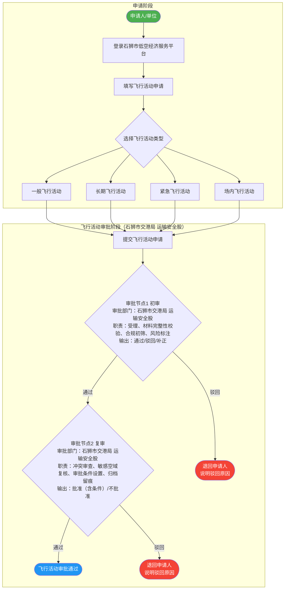

# 飞行活动审批详细流程

> **审批部门更新说明（用户确认）**
>
> 经用户最终确认：
> - **飞行活动申请** 两个审批节点（初审、复审）：**石狮市交港局 运输安全股**
> - **放飞申请** 审批节点：**石狮市公安局 治安管理大队**
>
> **Mermaid 兼容性说明**：节点内文本使用 ` ` 换行；边标签（`-->|...|`）仅保留简短文字，
> 避免在边标签内嵌入含顿号、全角括号等复杂中文标点，确保 GitHub Mermaid 正常渲染。

---

## 飞行活动审批详细流程图

---

## 审批节点说明

### 审批节点1 — 初审

| 项目 | 内容 |
|------|------|
| **审批部门** | 石狮市交港局 运输安全股 |
| **职责** | 受理、材料完整性校验、合规初筛、风险标注 |
| **输出** | 通过（流转至复审）/ 驳回（退回申请人并说明原因）/ 补正（退回补充材料） |

### 审批节点2 — 复审

| 项目 | 内容 |
|------|------|
| **审批部门** | 石狮市交港局 运输安全股 |
| **职责** | 冲突审查、敏感空域复核、审批条件设置、归档留痕 |
| **输出** | 批准（含条件）/ 不批准 |

---

*最后更新：2026-03-16*
