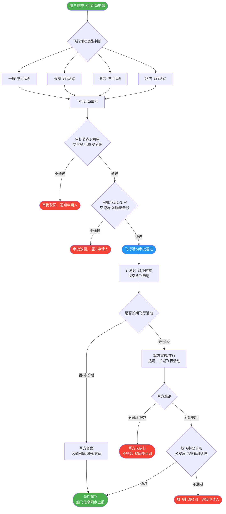
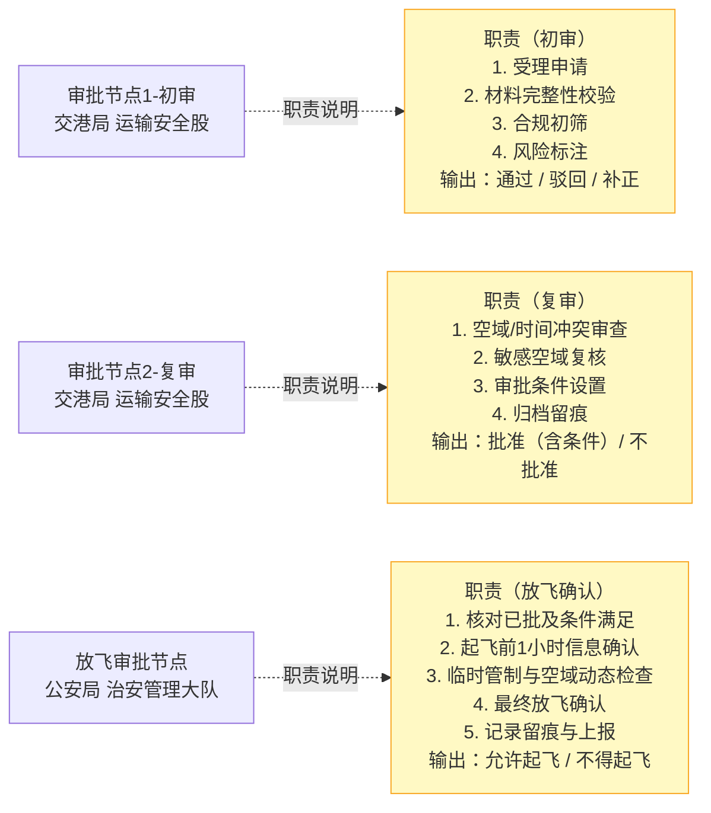
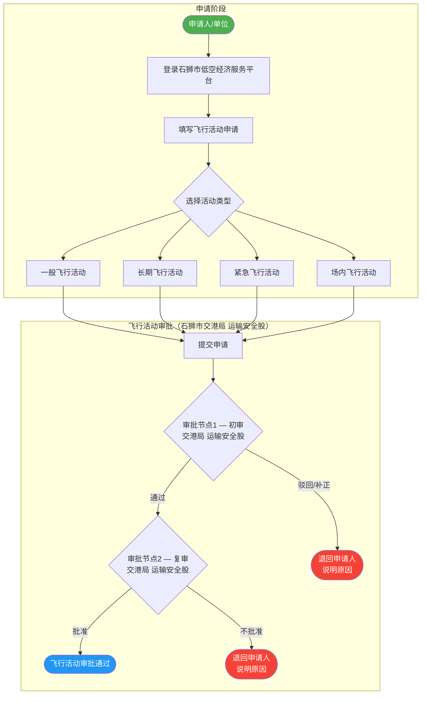
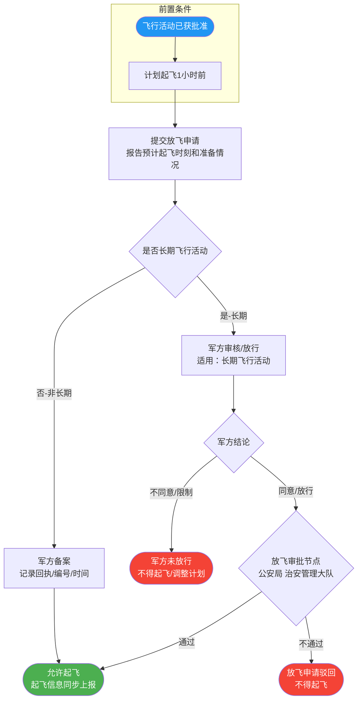
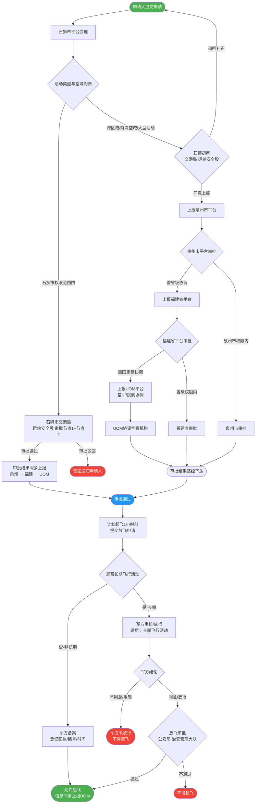

# 石狮市低空经济飞行审批流程

本文档描述石狮市低空经济服务平台飞行审批全流程，涵盖飞行活动审批（石狮市交港局 运输安全股）、放飞审批（石狮市公安局 治安管理大队）及军方对接逻辑。

> **渲染说明**：菱形节点只保留"节点名称 + 审批部门"，避免节点文字过长导致截断。完整职责说明统一列于「职责说明图」及下方表格，通过独立图保证节点完整可见、不被遮挡。
> 由于 GitHub Mermaid 使用 dagre 布局引擎，将职责旁路节点放入复杂 TD 主流程图会导致其被布局到画布边缘或与其他节点重叠。因此职责说明单独采用 `flowchart LR` 小图（仅3对节点），彻底消除遮挡风险。
>
> ⚠️ **维护注意**：「职责说明图」和「审批节点职责汇总表」中的职责描述内容相同，如需修改职责请同步更新两处。

---

## 一、总流程图

---

## 二、职责说明图

> 以下独立图仅展示各审批节点与其完整职责的虚线关联，与主流程图分离，确保职责节点完整可见、不被遮挡。

---

## 三、审批节点职责汇总表

| 审批节点 | 审批部门 | 完整职责 | 输出 |
|---------|---------|---------|------|
| **审批节点1 — 初审** | 石狮市交港局 运输安全股 | 1. 受理申请；2. 材料完整性校验；3. 合规初筛；4. 风险标注 | 通过 / 驳回 / 补正 |
| **审批节点2 — 复审** | 石狮市交港局 运输安全股 | 1. 空域/时间冲突审查；2. 敏感空域复核；3. 审批条件设置；4. 归档留痕 | 批准（含条件）/ 不批准 |
| **放飞审批节点** | 石狮市公安局 治安管理大队 | 1. 核对已批及条件满足；2. 起飞前1小时信息确认；3. 临时管制与空域动态检查；4. 最终放飞确认；5. 记录留痕与上报 | 允许起飞 / 不得起飞 |
| **军方备案**（非长期） | 军方（解放军/空军相关部门） | 非长期飞行活动，不阻断主流程，提交备案并取得回执编号 | 备案回执/编号/时间 |
| **军方审核/放行**（长期） | 军方（解放军/空军相关部门） | 长期飞行活动，阻断式等待军方明确放行指令 | 同意放行 / 不同意 / 限制条件 |

---

## 四、飞行活动审批细化图

**飞行活动审批节点职责（见「职责说明图」及汇总表）**

---

## 五、放飞审批细化图（含军方对接）

**放飞审批节点职责（见「职责说明图」及汇总表）**

---

## 六、纵向上报流程图

---

## 布局修复说明

| 问题 | 修复策略 |
|------|---------|
| 职责说明节点（初审/复审）在主流程图中被遮挡 | 将职责说明节点从主流程图中分离，放入独立的「职责说明图」（`flowchart LR`，仅3对节点），彻底消除与主流程的布局冲突 |
| 菱形节点文字过长导致截断 | 菱形节点只保留"节点名称 + 审批部门"，完整职责移至职责说明图和汇总表 |
| 军方逻辑与放飞流程关系不清 | 军方判断节点插入"提交放飞申请"之后：非长期→备案（不回公安）；长期→军方审核→公安放飞审批 |
