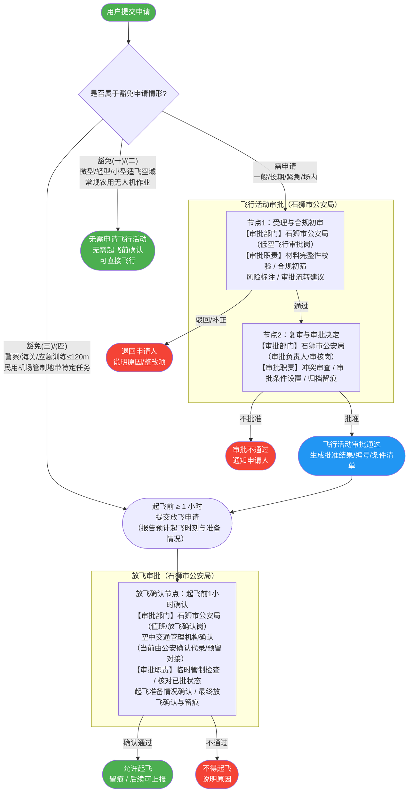

# 石狮低空飞行服务平台——飞行活动及放飞申请审批流程

## 一、流程总览

---

## 二、各审批节点详情

### 节点1：受理与合规初审

| 项目 | 内容 |
|---|---|
| **审批部门** | 石狮市公安局（低空飞行审批岗） |
| **审批职责** | 材料完整性校验、合规初筛（禁飞区/豁免类型判断）、风险标注（人群密集区/夜航/超视距等）、审批流转建议 |
| **输出** | 通过（流转节点2）/ 驳回（说明原因）/ 补正（列明缺失材料） |

### 节点2：复审与审批决定

| 项目 | 内容 |
|---|---|
| **审批部门** | 石狮市公安局（低空飞行审批负责人、审核岗） |
| **审批职责** | 复核关键要素、冲突审查（同空域/同时段/重大活动安保）、设置审批附加条件（限高/限区/现场警戒等）、归档留痕（审批编号/时间戳） |
| **输出** | 批准（含条件清单/编号）/ 不批准（说明原因） |

> 说明：两个审批节点可为同一人员或不同人员，系统均保留双节点记录以供追责与内控。

### 放飞确认节点：起飞前1小时确认

| 项目 | 内容 |
|---|---|
| **审批部门** | 石狮市公安局（值班、放飞确认岗）；**空中交通管理机构确认（当前由公安确认代录/预留对接）** |
| **审批职责** | 核对已批状态与审批条件是否满足、临时管制/空域变化检查、起飞准备情况（时刻/位置/设备/通信）确认、最终放飞确认与留痕（为后续上报省市/UOM预留字段） |
| **输出** | 允许起飞 / 不得起飞（说明原因） |
| **适用情形** | ① 飞行活动已审批通过的四类活动；② 豁免申请（备注三/四）但仍需起飞前确认的情形 |

---

## 三、豁免情形说明

| 豁免类别 | 情形描述 | 是否需要飞行活动申请 | 是否需要起飞前确认 |
|---|---|---|---|
| 豁免(一) | 微型/轻型/小型无人机在适飞空域内飞行 | ❌ 无需申请 | ❌ 无需确认 |
| 豁免(二) | 常规农用无人机作业飞行 | ❌ 无需申请 | ❌ 无需确认 |
| 豁免(三) | 警察、海关、应急管理部门驻地等上方≤120m飞行 | ❌ 无需申请 | ✅ 起飞前1小时须确认 |
| 豁免(四) | 民用无人机在民用运输机场管制地带内执行巡检、勘察、校验等（需定期备案） | ❌ 无需申请 | ✅ 起飞前1小时须确认 |

---

## 四、后续对接规划

当前审批由石狮市公安局通过内网平台执行。待福建省、泉州市平台建设完成后，本平台审批流程将纵向与省市级平台及国家平台 UOM 打通，届时：

- 飞行活动审批数据将逐级上报至：石狮 → 泉州市 → 福建省 → 国家 UOM
- **放飞确认节点的"空中交通管理机构确认"** 将由当前公安代录模式，逐步切换为 UOM/上级平台侧的正式确认接口对接
- 石狮平台保留"发起确认请求 + 接收确认结果 + 放飞执行留痕"能力

---

*本文档依据《无人驾驶航空器飞行管理暂行条例》及前期与漳州空军指挥所、石狮市公安局、石狮市交港局沟通结果编制。具体承办科室/岗位名称、驻场审批机制等待石狮市公安局确认后更新。*
