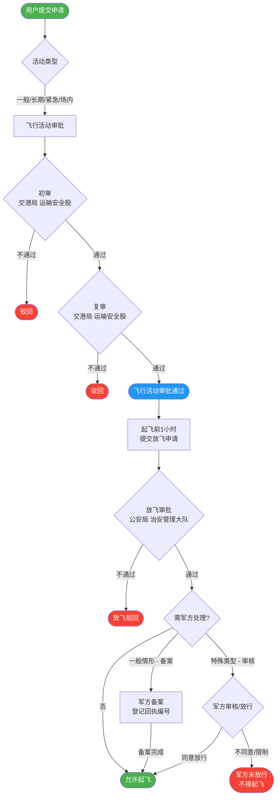
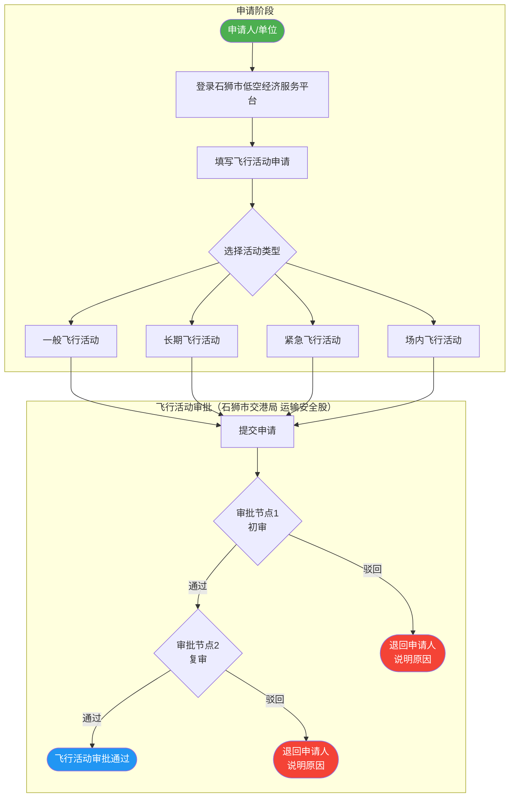
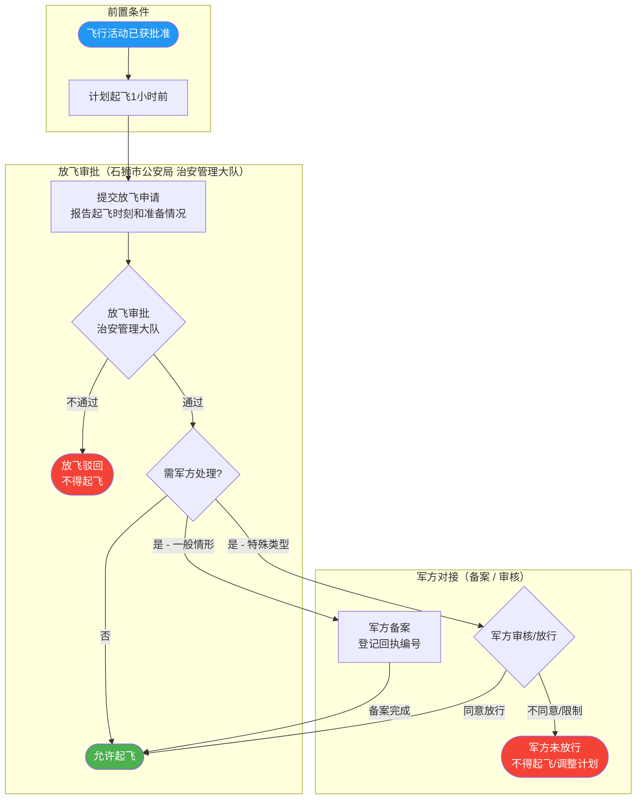
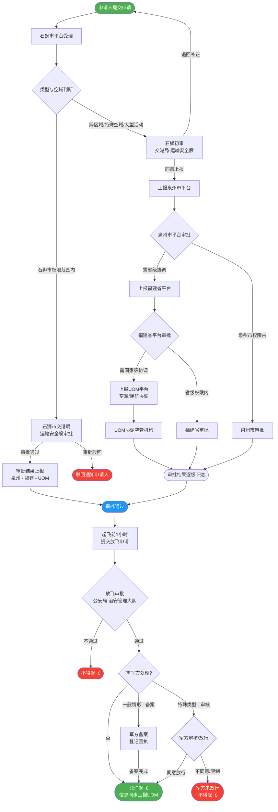

# 石狮市低空经济飞行审批流程

本文档描述石狮市低空经济服务平台的飞行审批全流程，涵盖飞行活动审批（石狮市交港局 运输安全股）、放飞审批（石狮市公安局 治安管理大队）以及军方对接（备案/审核）逻辑。

> **关于节点可读性**：各流程图节点仅保留关键词，详细职责与说明统一列于图下方的说明表格中，避免节点文字过长导致渲染截图不完整。

---

## 一、总流程图

### 节点说明

| 节点 | 负责部门 | 主要职责 | 输出 |
|------|---------|---------|------|
| 初审 | 石狮市交港局 运输安全股 | 受理、材料完整性校验、合规初筛、风险标注 | 通过 / 驳回 / 补正 |
| 复审 | 石狮市交港局 运输安全股 | 冲突审查、敏感空域复核、审批条件设置、归档留痕 | 批准（含条件）/ 不批准 |
| 放飞审批 | 石狮市公安局 治安管理大队 | 核对审批结果与条件满足情况；起飞前1小时信息确认；临时管制与空域动态检查；最终放飞确认；记录留痕 | 通过 / 不通过 |
| 军方备案 | 军方（解放军/空军相关部门） | 一般情形下备案登记，不阻断主流程，记录回执编号 | 备案回执编号 |
| 军方审核/放行 | 军方（解放军/空军相关部门） | 特殊类型下阻断式审核，需等待军方明确放行指令 | 同意放行 / 不同意 / 限制条件 |

---

## 二、飞行活动审批细化图

### 节点说明

| 节点 | 负责部门 | 职责 | 输出 |
|------|---------|------|------|
| 审批节点1 - 初审 | 石狮市交港局 运输安全股 | 受理、材料完整性校验、合规初筛、风险标注 | 通过 / 驳回 / 补正 |
| 审批节点2 - 复审 | 石狮市交港局 运输安全股 | 冲突审查、敏感空域复核、审批条件设置、归档留痕 | 批准（含条件）/ 不批准 |

---

## 三、放飞审批细化图（含军方对接）

### 放飞审批节点说明

| 节点 | 负责部门 | 说明 |
|------|---------|------|
| 放飞审批 | 石狮市公安局 治安管理大队 | 核对已批结果及条件满足情况；起飞前1小时信息确认；临时管制与空域动态检查；最终放飞确认；记录留痕 |
| 军方备案 | 军方对接 | 触发：一般飞行，不涉及特殊管控空域；动作：提交备案，取得回执编号，**不阻断主流程** |
| 军方审核/放行 | 军方对接 | 触发：涉及军方管控空域/临时管制/特定任务类型（规则待细化）；动作：**阻断式**等待军方放行指令 |

---

## 四、军方备案 vs 军方审核说明

### 触发条件

| 类型 | 触发条件（参考，待细化） | 是否阻断主流程 |
|------|----------------------|--------------|
| 军方备案（默认） | 一般飞行活动，空域不涉及军方管控区 | **否**，备案后直接允许起飞 |
| 军方审核/放行（特殊） | 涉及军方管控空域、临时管制区、特定任务类型等 | **是**，必须等待军方明确放行才能允许起飞 |

### 输入 / 输出 / 留痕字段建议

| 类型 | 输入 | 输出 | 留痕字段建议 |
|------|------|------|------------|
| 军方备案 | 飞行计划（时间、空域、机型、任务说明） | 备案回执/编号 | 回执编号、备案时间、备案单位、经办人 |
| 军方审核/放行 | 飞行计划详情、申请放行指令 | 同意放行指令 / 不同意决定 / 限制条件 | 回执/指令编号、审批时间、审批人、有效时限、限制内容 |

---

## 五、纵向上报流程图（含石狮初审与 UOM 对接）

### 石狮初审节点说明

| 节点 | 负责部门 | 说明 |
|------|---------|------|
| 石狮初审 | 石狮市交港局 运输安全股 | 适用于跨区域/特殊空域/大型活动；职责：材料完整性校验、合规初筛、风险标注、上报建议；输出：同意上报 / 退回补正 |
