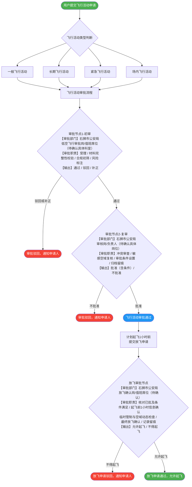

# 石狮低空飞行服务平台——飞行活动及起飞申请审批流程

> 本文档描述石狮市低空经济服务平台内飞行活动申请与放飞申请的完整审批流程，
> 审批机构为**石狮市公安局**，审批系统部署在内网，由驻场人员执行。

---

## 审批总流程

> **注：** 节点 H（初审）、I（复审）、L（放飞审批）均已在图中标注【审批部门】与【审批职责】。
> 为保证 GitHub Mermaid 渲染正常，节点内文本使用 ` ` 换行，边标签（edge label）仅保留简短文字，
> 避免在 `-->|...|` 内嵌入含顿号、书名号等复杂中文标点而导致解析器报错。

---

## 审批节点说明

### 审批节点 H — 初审

| 项目 | 说明 |
|---|---|
| **审批部门** | 石狮市公安局（低空飞行审批岗 / 值班席位，**待确认具体科室**） |
| **审批职责** | 受理、材料完整性校验、合规初筛、风险标注 |
| **输出结果** | 通过 → 流转至复审；驳回 → 退回申请人并说明原因；补正 → 退回补充材料 |

**职责详解：**

1. **受理与材料完整性校验**：核验申请主体、实名信息、航空器信息、操控员资质、飞行计划要素（时间 / 航线 / 空域 / 高度 / 任务性质）、应急预案等。
2. **合规初筛**：判断是否属于豁免申请情形；是否涉及禁飞 / 限飞区；高度、时间段、活动类型是否触发更高等级管制要求。
3. **风险标注**：对人群密集区、敏感目标周边、夜航、超视距、多机编队等情形进行风险等级标注，提出审批条件建议。

---

### 审批节点 I — 复审

| 项目 | 说明 |
|---|---|
| **审批部门** | 石狮市公安局（审核岗 / 负责人，**待确认具体岗位**） |
| **审批职责** | 冲突审查、敏感空域复核、审批条件设置、归档留痕 |
| **输出结果** | 批准（含附加条件）；不批准（说明原因） |

**职责详解：**

1. **冲突审查**：与同空域 / 同时间段其他飞行活动冲突检测；重大活动安保期、临时管制等情形复核。
2. **敏感空域复核**：重点目标周边、禁限飞区边界核准、军民航情报核验。
3. **审批条件设置**：形成审批决定时明确附加条件（如限高、限定航线范围、现场警戒、远程识别开启要求等）。
4. **归档留痕**：审批意见、条件、审批人、时间戳电子存档，作为后续监管与纵向上报依据。

---

### 审批节点 L — 放飞审批

| 项目 | 说明 |
|---|---|
| **审批部门** | 石狮市公安局（放飞确认岗 / 值班席位，**待确认是否与审批岗同席位**） |
| **审批职责** | 核对已批及条件满足、起飞前1小时信息确认、临时管制与空域动态检查、最终放飞确认、记录留痕 |
| **输出结果** | 允许起飞（记录确认时间 / 预计起飞时刻）；不得起飞（原因 + 整改建议） |

**职责详解：**

1. **前置核验**：核对飞行活动"已审批通过且在有效期 / 有效空域内"，核对审批条件是否已满足。
2. **起飞前1小时信息确认**：预计起飞时刻、起飞点坐标、飞行范围 / 高度是否与批准一致；人员到位、设备状态、通信链路、应急预案准备情况。
3. **临时空域动态检查**：核查是否新增临时管制 / 警卫任务 / 突发事件禁飞；必要时暂停放飞并要求调整计划。
4. **最终放飞确认**：确认后方可起飞；拒绝需给出原因（条件未满足 / 空域临时变化 / 信息不一致等）。
5. **记录留痕**：记录确认时间、确认人、确认结论；为后续向市 / 省 / UOM 同步"实际起飞窗口"数据做准备。

---

## 待确认事项

1. **具体承办科室 / 岗位名称**：建议明确"审批岗（初审）、审核岗（复审）、放飞确认岗"对应的科室与人员名单或值班席位制度。
2. **双节点是否必须由不同人员操作**：制度上建议不同人；人手不足时系统保留两节点并记录"同人复核"标记。
3. **与空中交通管理机构确认的证据形式**：电话录音 / 短信回执 / 电子回执 / 上级平台回执编号，平台字段需预留。
4. **驻场审批机制**：内网部署 + 指挥大厅 / 办公席位，建议确认是否 7×24 或工作时段值守。
5. **后续对接规划**：待福建省、泉州市平台建设完成后，本平台审批流程纵向与省市级平台及国家平台 UOM 打通，届时审批权限边界与数据上报字段需同步调整。

---

## 豁免申请情形说明

根据《无人驾驶航空器飞行管理暂行条例》，以下情形**无需**向空中交通管理机构提出飞行活动申请：

1. 微型、轻型、小型无人驾驶航空器在适飞空域内的飞行活动——**无需申请，无需放飞确认**。
2. 常规农用无人驾驶航空器作业飞行活动——**无需申请，无需放飞确认**。
3. 警察、海关、应急管理部门辖有的无人驾驶航空器，在其驻地等上方不超过真高120米的空域内飞行——**无需申请飞行活动，但需在计划起飞1小时前经空中交通管理机构确认后方可起飞**。
4. 民用无人驾驶航空器在民用运输机场管制地带内执行巡检、勘察、校验等任务——**需定期报备，并在计划起飞1小时前经空中交通管理机构确认后方可起飞**。

---

*最后更新：2026-03-12*
