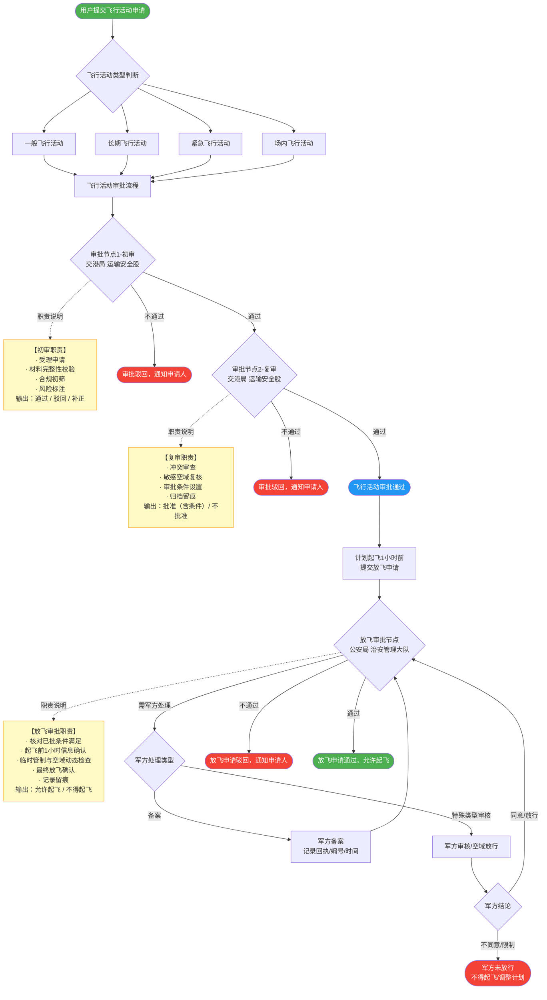
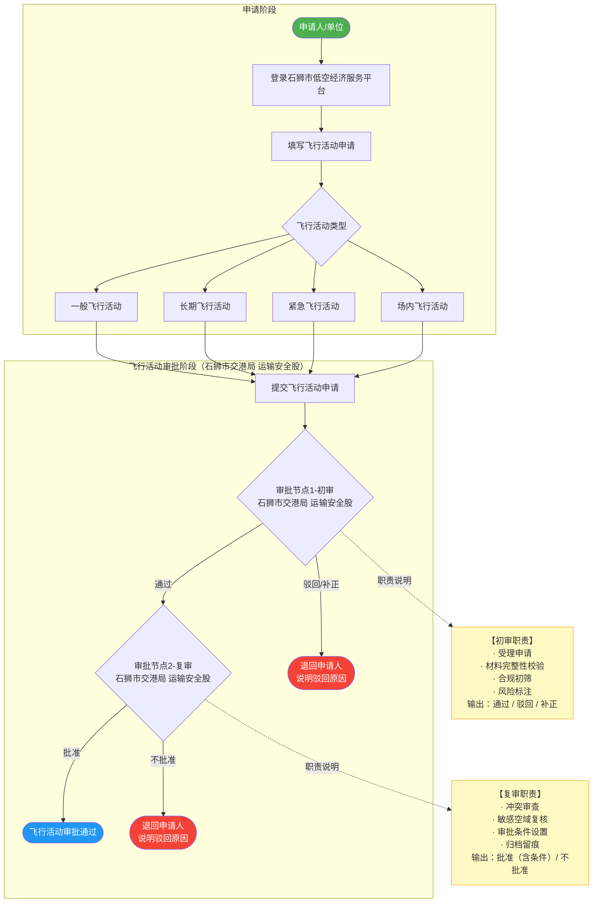
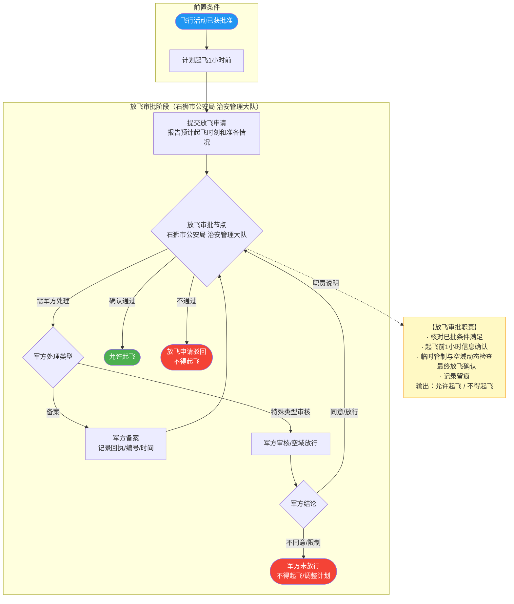
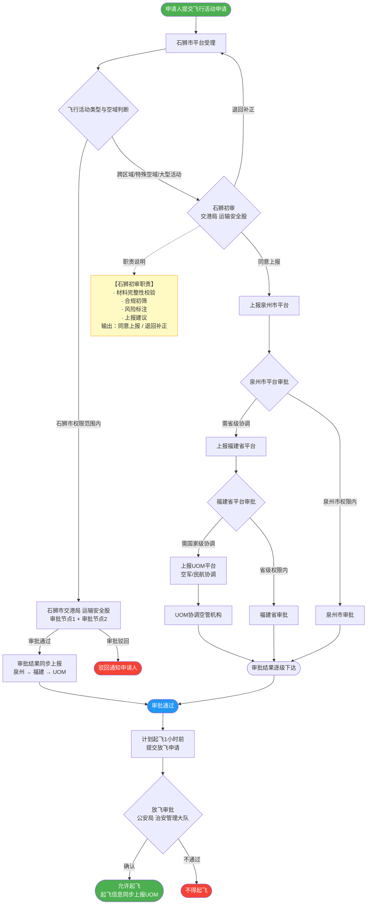

# 石狮市低空飞行审批流程图

> **渲染说明**：本文档采用"菱形节点（审批节点）+ 虚线旁路矩形节点（职责说明）"的版式，避免菱形内文字过长导致渲染/截图展示不全。菱形节点只保留**节点名称 + 审批部门**，完整职责均在黄色"职责说明"节点中展示。

---

## 一、总流程图（简图）

---

## 二、飞行活动审批详细流程

> 审批部门：**石狮市交港局 运输安全股**（两级审批）

---

## 三、放飞审批详细流程

> 审批部门：**石狮市公安局 治安管理大队**；军方仅备案或特殊类型审核。

---

## 四、纵向上报流程图

> 石狮市权限范围内由交港局直接审批；跨区域/特殊空域需经石狮初审后逐级上报至泉州、福建、UOM。

---

## 审批节点职责汇总

| 审批节点 | 审批部门 | 完整职责 |
|---------|---------|---------|
| **审批节点1-初审** | 石狮市交港局 运输安全股 | 受理申请、材料完整性校验、合规初筛、风险标注 |
| **审批节点2-复审** | 石狮市交港局 运输安全股 | 冲突审查、敏感空域复核、审批条件设置、归档留痕 |
| **石狮初审**（跨区域上报前） | 石狮市交港局 运输安全股 | 材料完整性校验、合规初筛、风险标注、上报建议 |
| **放飞审批节点** | 石狮市公安局 治安管理大队 | 核对已批条件满足、起飞前1小时信息确认、临时管制与空域动态检查、最终放飞确认、记录留痕 |
| **军方对接**（备案/审核） | 解放军相关部门 | 备案：记录回执/编号/时间；特殊类型审核：空域放行确认 |

---

## 修复说明

**问题根因**：菱形节点（`{}`）内文字过长，在 GitHub Mermaid 渲染及截图中溢出或被裁切；同时将完整职责缩短为"要点"关键词导致职责信息不完整。

**本次解决策略**：
1. **菱形节点瘦身**：菱形只保留"节点名称 + 审批部门"，保持节点尺寸可控。
2. **职责旁路节点**：完整职责移入黄色矩形"职责说明"节点，与菱形用虚线（`-.->`)连接，不干扰主流程。
3. **条目式排版**：职责用`·`前缀分行列出，避免单行过宽。
4. **全图一致性**：四张流程图统一采用以上版式，确保一致展示完整职责。
