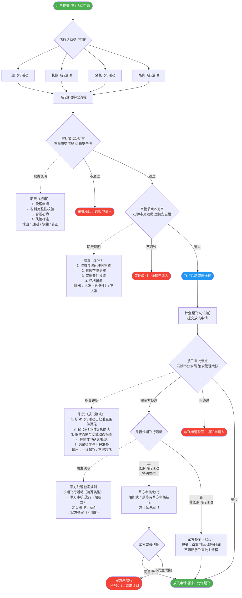

# 无人机飞行活动审批流程

## 流程概述

本文档描述石狮市无人机飞行活动的完整审批流程，包含飞行活动审批与放飞审批两个主要阶段，以及军方处理规则。

### 审批部门说明

| 节点 | 审批部门 |
|------|----------|
| 飞行活动审批节点1（初审） | 石狮市交港局 运输安全股 |
| 飞行活动审批节点2（复审） | 石狮市交港局 运输安全股 |
| 放飞审批节点 | 石狮市公安局 治安管理大队 |

### 军方处理规则说明

| 类型 | 触发条件 | 处理方式 | 是否阻断放飞审批 |
|------|----------|----------|-----------------|
| 军方备案（默认） | 需军方处理，且非长期飞行活动 | 记录备案回执/编号/时间后继续 | **否**（不阻断主流程） |
| 军方审核/放行（特殊类型） | 需军方处理，且为**长期飞行活动** | 等待军方审核结论，同意方可起飞 | **是**（阻断式） |

> **说明**：长期飞行活动属于"特殊类型"，在放飞审批阶段如需军方处理，须经军方审核/放行（阻断式）；军方不同意则不得起飞或须调整计划。非长期飞行活动如需军方处理时，走军方备案流程，备案完成后不阻断放飞审批主流程。

---

## 完整审批流程图

> **说明**：菱形节点只显示节点名称与审批部门；完整职责通过虚线连接至旁路矩形节点展示，保证图形清晰不截断。

---

## 各节点职责详表

### 审批节点1 — 初审

**审批部门**：石狮市交港局 运输安全股

| 职责项 | 说明 |
|--------|------|
| 受理申请 | 接收申请人提交的飞行活动申请材料 |
| 材料完整性校验 | 核查申请材料是否齐全，格式是否符合要求 |
| 合规初筛 | 初步判断申请是否符合相关法律法规及管理规定 |
| 风险标注 | 对飞行活动涉及的潜在风险进行初步标注 |
| **输出** | 通过 / 驳回 / 补正 |

---

### 审批节点2 — 复审

**审批部门**：石狮市交港局 运输安全股

| 职责项 | 说明 |
|--------|------|
| 空域与时间冲突审查 | 审查申请飞行的空域、时段是否与已批准的其他活动冲突 |
| 敏感空域复核 | 核查飞行路线是否经过敏感、禁飞或限制区域 |
| 审批条件设置 | 对有条件批准的申请设定具体限制条件（如限高、限时、限航线） |
| 归档留痕 | 将审批过程及结论完整归档记录 |
| **输出** | 批准（含条件）/ 不批准 |

---

### 放飞审批节点

**审批部门**：石狮市公安局 治安管理大队

| 职责项 | 说明 |
|--------|------|
| 核对已批及条件满足 | 确认飞行活动已获审批且所有附加条件均已满足 |
| 起飞前1小时信息确认 | 在计划起飞前1小时内接收并确认放飞申请信息 |
| 临时管制与空域动态检查 | 核查是否存在临时管制通知或空域动态变化 |
| 最终放飞确认/拒绝 | 综合以上信息做出允许起飞或不得起飞的最终决定 |
| 记录留痕与上报准备 | 记录放飞审批过程，准备上报相关信息 |
| **输出** | 允许起飞 / 不得起飞 |

---

### 军方处理规则（放飞审批节点分支）

**触发**：在放飞审批节点，审批过程中发现需要军方处理时触发本分支。

#### 军方备案（默认）

适用：**非长期飞行活动**需军方处理时。

| 步骤 | 说明 |
|------|------|
| 发起备案 | 向军方提交备案申请，附飞行活动信息 |
| 获取回执 | 记录军方备案回执编号及时间 |
| 继续主流程 | 备案完成后**不阻断**放飞审批主流程，继续进行放飞审批流程并获取最终放飞结论 |

#### 军方审核/放行（特殊类型）

适用：**长期飞行活动**需军方处理时（特殊类型）。

| 步骤 | 说明 |
|------|------|
| 发起审核 | 向军方提交审核申请，附飞行活动详细方案 |
| 等待审核结论 | **阻断式**等待军方给出审核结论 |
| 同意/放行 | 军方审核通过，允许起飞 |
| 不同意/限制 | 军方审核未通过，**不得起飞**，须调整飞行计划后重新申请 |
