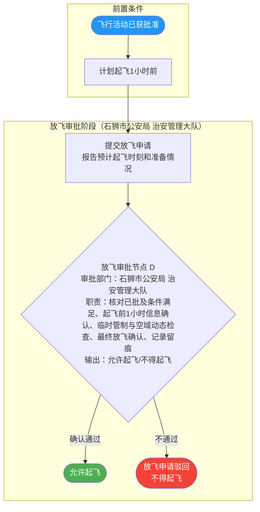

# 低空飞行审批流程文档

## 概述

本文档描述石狮市低空经济服务平台的飞行活动申请与审批流程，包括飞行活动审批和放飞（起飞）审批两个主要环节。

---

## 一、总流程图

```mermaid
flowchart TD
    A([用户提交飞行活动申请]) --> B{飞行活动类型判断}
    B --> C[一般飞行活动]
    B --> D[长期飞行活动]
    B --> E[紧急飞行活动]
    B --> F[场内飞行活动]

    C --> G[飞行活动审批流程]
    D --> G
    E --> G
    F --> G

    G --> H{审批节点1 - 初审<br>审批部门：石狮市交港局 运输安全股<br>职责：受理、材料完整性校验、合规初筛、风险标注<br>输出：通过/驳回/补正}
    H -->|不通过| R1([审批驳回，通知申请人])
    H -->|通过| I{审批节点2 - 复审<br>审批部门：石狮市交港局 运输安全股<br>职责：冲突审查、敏感空域复核、审批条件设置、归档留痕<br>输出：批准(含条件)/不批准}
    I -->|不通过| R2([审批驳回，通知申请人])
    I -->|通过| J([飞行活动审批通过])

    J --> K[计划起飞1小时前<br>提交放飞申请]
    K --> L{放飞审批节点 - 审批<br>审批部门：石狮市公安局 治安管理大队<br>职责：核对已批及条件满足、起飞前1小时信息确认、临时管制与空域动态检查、最终放飞确认、记录留痕<br>输出：允许起飞/不得起飞}
    L -->|不通过| R3([放飞申请驳回，通知申请人])
    L -->|通过| M([放飞申请通过，允许起飞])

    style A fill:#4CAF50,color:#fff
    style J fill:#2196F3,color:#fff
    style M fill:#4CAF50,color:#fff
    style R1 fill:#f44336,color:#fff
    style R2 fill:#f44336,color:#fff
    style R3 fill:#f44336,color:#fff
```

---

## 二、飞行活动审批详细流程

```mermaid
flowchart TD
    subgraph 申请阶段
        A([申请人/单位]) --> B[登录石狮市低空经济服务平台]
        B --> C[填写飞行活动申请]
        C --> D{选择飞行活动类型}
        D --> D1[一般飞行活动]
        D --> D2[长期飞行活动]
        D --> D3[紧急飞行活动]
        D --> D4[场内飞行活动]
    end

    D1 --> E
    D2 --> E
    D3 --> E
    D4 --> E

    subgraph 飞行活动审批阶段["飞行活动审批阶段（石狮市交港局 运输安全股）"]
        E[提交飞行活动申请] --> F{审批节点1 - 初审<br>审批部门：石狮市交港局 运输安全股<br>职责：受理、材料完整性校验、合规初筛、风险标注<br>输出：通过/驳回/补正}
        F -->|通过| G{审批节点2 - 复审<br>审批部门：石狮市交港局 运输安全股<br>职责：冲突审查、敏感空域复核、审批条件设置、归档留痕<br>输出：批准(含条件)/不批准}
        F -->|驳回| F1([退回申请人<br>说明驳回原因])
        G -->|通过| H([飞行活动审批通过])
        G -->|驳回| G1([退回申请人<br>说明驳回原因])
    end

    style A fill:#4CAF50,color:#fff
    style H fill:#2196F3,color:#fff
    style F1 fill:#f44336,color:#fff
    style G1 fill:#f44336,color:#fff
```

---

## 三、放飞审批详细流程



---

## 四、审批部门职责说明

| 审批环节 | 审批部门 | 主要职责 |
|---------|---------|---------|
| 飞行活动审批（初审） | 石狮市交港局 运输安全股 | 受理申请、材料完整性校验、合规初筛、风险标注 |
| 飞行活动审批（复审） | 石狮市交港局 运输安全股 | 冲突审查、敏感空域复核、审批条件设置、归档留痕 |
| 放飞（起飞）审批 | 石狮市公安局 治安管理大队 | 核对已批及条件满足、起飞前1小时信息确认、临时管制与空域动态检查、最终放飞确认、记录留痕 |
