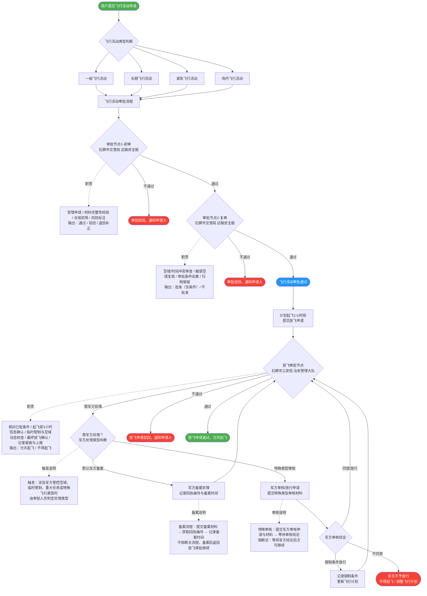

# 无人机飞行活动审批流程

## 概述

本文档描述石狮市无人机飞行活动审批全流程，涵盖飞行活动审批（两级）、放飞审批及军方对接处理逻辑。

- **飞行活动审批**：石狮市交港局 运输安全股（审批节点1初审 + 审批节点2复审）
- **放飞审批**：石狮市公安局 治安管理大队
- **军方处理**：备案为主，特殊类型须军方审核/放行

---

## 完整审批流程图

---

## 审批节点职责说明

### 审批节点1 — 初审

| 项目 | 内容 |
|------|------|
| **审批部门** | 石狮市交港局 运输安全股 |
| **职责** | 受理申请、材料完整性校验、合规初筛、风险标注 |
| **输出** | 通过 / 驳回 / 退回补正 |

### 审批节点2 — 复审

| 项目 | 内容 |
|------|------|
| **审批部门** | 石狮市交港局 运输安全股 |
| **职责** | 空域/时间冲突审查、敏感空域复核、审批条件设置、归档留痕 |
| **输出** | 批准（含条件）/ 不批准 |

### 放飞审批节点

| 项目 | 内容 |
|------|------|
| **审批部门** | 石狮市公安局 治安管理大队 |
| **职责** | 核对飞行活动已批准且条件满足、起飞前1小时信息确认、临时管制与空域动态检查、最终放飞确认/拒绝、记录留痕与上报准备 |
| **输出** | 允许起飞 / 不得起飞 |

---

## 军方处理逻辑说明

军方处理分支在**放飞审批节点**处触发，分为两类：

### A. 默认军方备案（不阻断主流程）

适用于一般涉军空域飞行，备案后即可继续放飞审批流程。

| 步骤 | 内容 |
|------|------|
| 1 | 向军方提交备案材料 |
| 2 | 获取回执编号 |
| 3 | 记录备案时间 |
| 4 | 备案完成后，流程返回放飞审批节点继续处理 |

### B. 特殊类型军方审核/放行（阻断式）

适用于重大任务、特殊飞行类型或军方管控空域，须等待军方审核结论后方可继续。

| 军方结论 | 后续处理 |
|---------|---------|
| 同意/放行 | 返回放飞审批节点继续 |
| 限制条件放行 | 记录限制条件，更新飞行计划后返回放飞审批节点 |
| 不同意 | 不得起飞，申请人需调整飞行计划 |

---

## 备注

- 军方处理类型（备案 / 特殊审核）由审批人员根据飞行任务性质判定。
- 所有审批结果均须记录留痕，并按要求逐级上报（泉州 → 福建 → UOM）。
