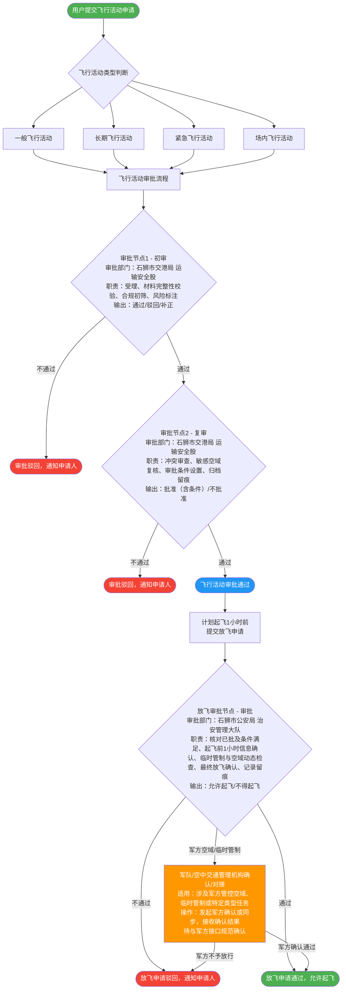
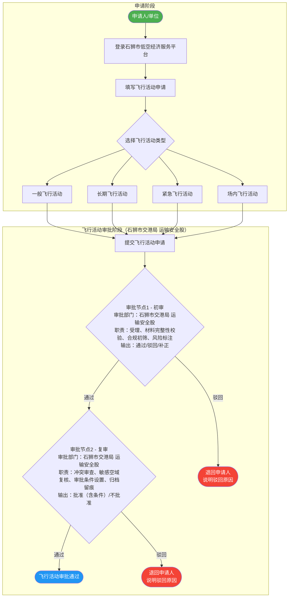
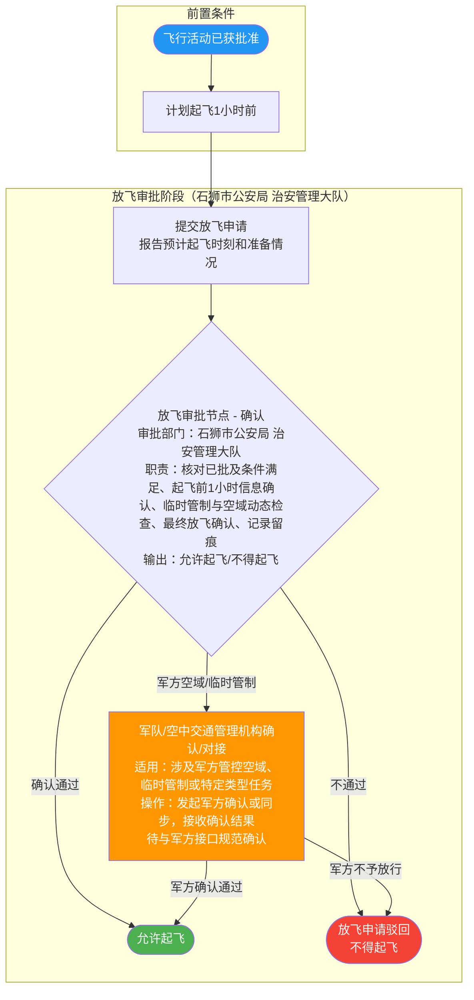

# 低空飞行活动审批与放飞流程

本文档描述石狮市低空经济服务平台的飞行活动审批流程及放飞审批流程。

---

## 一、飞行活动审批 + 放飞审批 总流程

> **军队对接分支说明**
>
> 当放飞审批节点（石狮市公安局 治安管理大队）在审批过程中发现飞行任务涉及以下情形之一时，需触发"军队/空中交通管理机构确认/对接"分支：
> - 飞行区域涉及**军方管控空域**或**临时限制/禁止空域**
> - 飞行计划处于**临时管制**期间
> - 任务性质属于**特定类型**（如大型活动保障、特种飞行等）需军方协调确认
>
> ⚠️ **待与军方接口规范确认**：军方确认的具体流程、接口标准及数据格式，需与军队空管部门协商后进一步明确。

---

## 二、飞行活动审批详细流程

---

## 三、放飞审批详细流程

> **军队对接分支说明（放飞审批）**
>
> 当放飞审批节点在审批过程中发现飞行任务涉及军方管控空域、临时管制或特定类型任务时，审批人员需触发"军队/空中交通管理机构确认/对接"流程：
> 1. 由治安管理大队值班席位或系统自动发起军方确认请求；
> 2. 军方反馈"确认通过"后，方可最终允许起飞；
> 3. 军方反馈"不予放行"时，作驳回处理并通知申请人。
>
> ⚠️ **待与军方接口规范确认**：具体确认流程、接口标准及数据格式需与军队空管部门协商后进一步明确。
