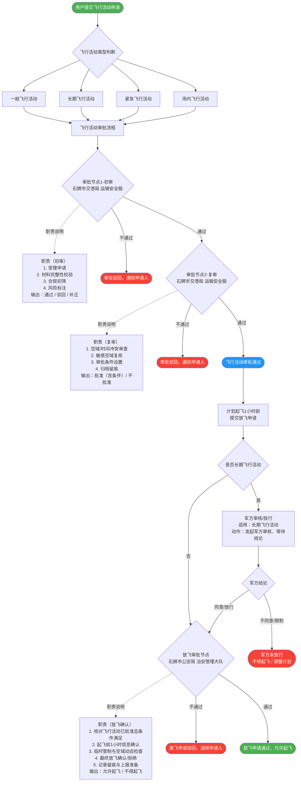

# 无人机飞行审批流程文档

## 一、总体说明

本文档描述石狮市无人机飞行活动审批及放飞流程，包含飞行活动审批、放飞申请、军方处理（长期飞行活动强制军方审核/放行）等环节。

---

## 二、业务规则说明

### 2.1 军方处理触发规则

| 飞行活动类型 | 军方处理方式 | 是否阻断流程 |
|---|---|---|
| **长期飞行活动** | **军方审核/放行（必须）** | **是（阻断式）** |
| 一般飞行活动 | 无需军方审核 | 否 |
| 紧急飞行活动 | 无需军方审核 | 否 |
| 场内飞行活动 | 无需军方审核 | 否 |

> **规则说明**：只要是**长期飞行活动**，则默认必须走"军方审核/放行"（阻断式）。军方不同意/限制，则不得起飞或需调整计划。非长期飞行活动不走军方审核，直接进入放飞审批节点。

---

### 2.2 军方节点插入位置

军方节点**从"提交放飞申请（K）到放飞审批节点（L）之间"插入**，即在 K→L 连线处增加"是否长期飞行活动"判断节点：

- K（提交放飞申请）→ X{是否长期飞行活动}
- X --否--> L（放飞审批，石狮市公安局 治安管理大队）
- X --是--> M（军方审核/放行）→ M2{军方结论}
- M2 --同意/放行--> L
- M2 --不同意/限制--> 不得起飞/调整计划

---

## 三、飞行活动审批总流程图

---

## 四、流程节点详细说明

### 4.1 审批节点1 — 初审

| 属性 | 内容 |
|---|---|
| **审批部门** | 石狮市交港局 运输安全股 |
| **职责** | 受理申请；材料完整性校验；合规初筛；风险标注 |
| **输出** | 通过 / 驳回 / 补正 |

### 4.2 审批节点2 — 复审

| 属性 | 内容 |
|---|---|
| **审批部门** | 石狮市交港局 运输安全股 |
| **职责** | 空域/时间冲突审查；敏感空域复核；审批条件设置；归档留痕 |
| **输出** | 批准（含条件）/ 不批准 |

### 4.3 军方审核/放行节点（长期飞行活动专用）

| 属性 | 内容 |
|---|---|
| **触发条件** | 飞行活动类型为**长期飞行活动** |
| **处理方式** | **阻断式** — 必须等待军方结论，方可进入放飞审批 |
| **军方同意/放行** | 进入放飞审批节点（L） |
| **军方不同意/限制** | 不得起飞 / 调整计划（流程终止） |

### 4.4 放飞审批节点

| 属性 | 内容 |
|---|---|
| **审批部门** | 石狮市公安局 治安管理大队 |
| **职责** | 核对飞行活动已批准且条件满足；起飞前1小时信息确认；临时管制与空域动态检查；最终放飞确认/拒绝；记录留痕与上报准备 |
| **输出** | 允许起飞 / 不得起飞 |

---

## 五、节点可读性设计说明

为解决 GitHub Mermaid 渲染时节点内容过长导致的截断/展示不全问题，流程图采用以下策略：

1. **菱形节点（审批/判断节点）** 只保留：节点名称 + 审批部门；
2. **完整职责** 移至旁路矩形节点，通过**虚线（`-.职责说明.->`）**关联；
3. **军方节点** 插入位置：从"提交放飞申请（K）→ 放飞审批节点（L）"连线的中间，即先判断是否长期飞行活动，再决定是否走军方审核/放行，确保节点层级清晰、不遮挡主干流程。

---

## 六、关键路径汇总

| 路径 | 流转说明 |
|---|---|
| 一般/紧急/场内 → 审批通过 → 放飞申请 → 直接放飞审批 → 允许起飞 | 无军方介入 |
| **长期飞行活动 → 审批通过 → 放飞申请 → 军方审核/放行（同意）→ 放飞审批 → 允许起飞** | **军方阻断式审核，通过后方可放飞** |
| 长期飞行活动 → 审批通过 → 放飞申请 → 军方审核/放行（不同意/限制）→ 不得起飞 | 军方拒绝，流程终止 |
| 任意类型 → 审批节点1/2 驳回 → 通知申请人 | 审批不通过 |
| 任意类型 → 放飞审批不通过 → 放飞申请驳回 | 放飞不通过 |
