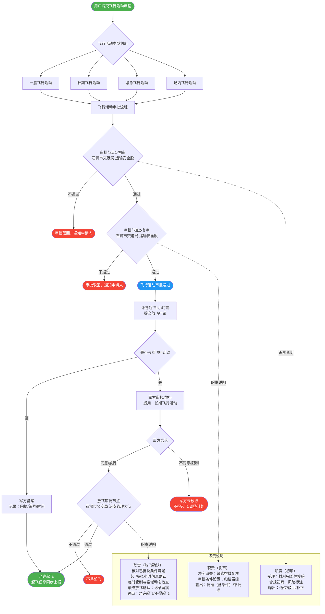

# 飞行活动审批及放飞流程

## 总流程图

> **布局说明**：职责说明节点（Hx/Ix/Lx）统一收入右侧「职责说明」子图分栏，
> 通过虚线从对应审批节点（H/I/L）引出，避免与主流程节点重叠或被画布边缘裁切。

## 业务规则说明

| 飞行活动类型 | 军方处理方式 | 公安放飞审批 |
|------------|------------|------------|
| 一般飞行活动 | 军方备案（不阻断，不回公安） | 不经过 |
| 紧急飞行活动 | 军方备案（不阻断，不回公安） | 不经过 |
| 场内飞行活动 | 军方备案（不阻断，不回公安） | 不经过 |
| **长期飞行活动** | **军方审核/放行（阻断式）** | **必须经过（仅限此类型）** |

## 审批节点职责说明

### 节点1 — 初审（石狮市交港局 运输安全股）

- 受理申请
- 材料完整性校验
- 合规初筛
- 风险标注
- **输出**：通过 / 驳回 / 补正

### 节点2 — 复审（石狮市交港局 运输安全股）

- 冲突审查
- 敏感空域复核
- 审批条件设置
- 归档留痕
- **输出**：批准（含条件）/ 不批准

### 放飞确认节点（石狮市公安局 治安管理大队）

- 核对已批条件满足情况
- 起飞前1小时信息确认
- 临时管制与空域动态检查
- 最终放飞确认
- 记录留痕
- **输出**：允许起飞 / 不得起飞
